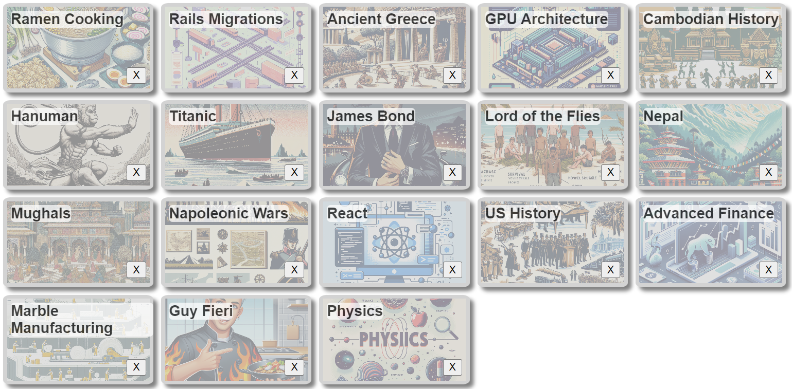

<h1>Socrates Production README</h1>

[Live Site](https://socrates-quiz-app.onrender.com/)

<h2>App Description</h2>

Socrates is a web application that allows users to create quizzes on a topic and difficulty level of their choosing

When the user creates a quiz, a request is sent from Socrates' backend to OpenAI which returns a ten question quiz with a difficulty level of the users choosing.  Further, another request is sent to OpenAI in order to provide a cover photo for each quiz relevant to the quizzes subject matter.

The user's generated quizzes are saved on their page where they can take, or retake a quiz.  Once a quiz is taken, the user instantaneously gets the results which are added to their analytics page.

A user's analytics page is a dashboard where the number of correct, incorrect and unanswered questions are presented in pie charts for each respective difficulty level, and one pie chart for the user's combined stats.

<h2>Instructions</h2>

Firstly, when you get to the splash page, you can login or signup in the upper right hand corner

Once logged in, you will be taken to the quiz index page. If you are using the Demo Login, there will be a directory of quizzes already generated.  Simply click on the quiz in order to take it.

If you wish to create a new quiz, simply click the "Create a New Quiz" button at the top of the page.  Select your topic and your difficulty level and Socrates will generate a quiz for you to take.

Also on the quiz index page, to the upper left, you can click on "Profile" which will show you your analytics, like how many questions you answered, how many were correct, etc.

Finally, you can logout to the upper right as well as view the "About Us" page which has links for the team's GitHub and LinkedIn.

<h2>Technologies Utilized</h2>

1. React
2. Redux
3. MongoDB
4. AWS S3
5. OpenAI API
6. Mongoose
7. Express.js
8. Node.js

<h2>Noteworthy Features</h2>

<h3>Quizzes</h3>

Quizzes are a full CRUD feature where you can create, read, update and delete a quiz.

For the creation of the quiz, once the user selects a topic and a difficulty level, we send a request to OpenAI's API to generate a ten question quiz and return it in JSON format.  Please referene the below code snippet for the request that is sent to OpenAI

Following the creation of the quiz, the user can take the quiz and their responses are updated in the quiz instance.  Their responses are compared to the correct answers which were provided by Open AI and in the user's profile, they can see their analytics which tracks unanswered questions, correct answers and incorrect answers.  Below is a snapshot of the analytics dashboard.

For the final CRUD feature, users can delete a quiz they created.  Below is a photo of the "Delete Quiz" button on the quiz directory.

