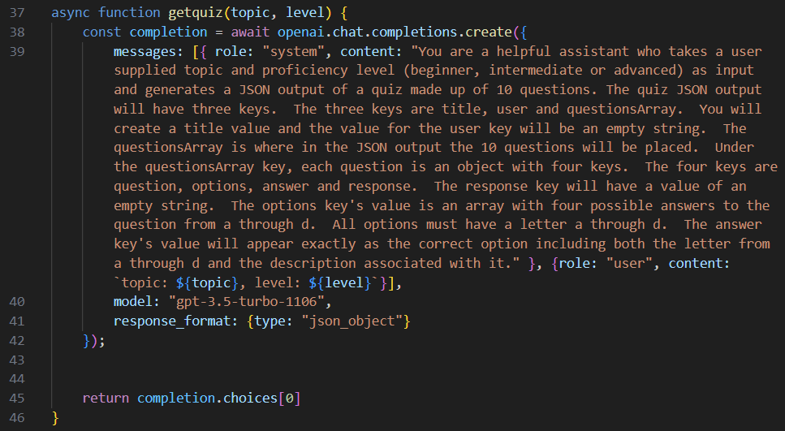

<h1>Socrates Production README</h1>

[Live Site](https://socrates-quiz-app.onrender.com/)

<h2>App Description</h2>

Socrates is a web application that allows users to create quizzes on a topic and difficulty level of their choosing

When the user creates a quiz, a request is sent from Socrates' backend to OpenAI which returns a ten question quiz with a difficulty level of the users choosing.  Further, another request is sent to OpenAI in order to provide a cover photo for each quiz relevant to the quizzes subject matter.

The user's generated quizzes are saved on their page where they can take, or retake a quiz.  Once a quiz is taken, the user instantaneously gets the results which are added to their analytics page.

A user's analytics page is a dashboard where the number of correct, incorrect and unanswered questions are presented in pie charts for each respective difficulty level, and one pie chart for the user's combined stats.

<h2>Technologies Utilized</h2>

1. React
2. Redux
3. MongoDB
4. AWS S3
5. OpenAI API
6. Mongoose
7. Express.js
8. Node.js

<h2>Noteworthy Features</h2>

<h3>Quizzes</h3>

Quizzes are a full CRUD feature where you can create, read, update and delete a quiz.

For the creation of the quiz, once the user selects a topic and a difficulty level, we send a request to OpenAI's API to generate a ten question quiz and return it in JSON format.  Please referene the below code snippet for the request that is sent to OpenAI

<h3>Friending</h3>

